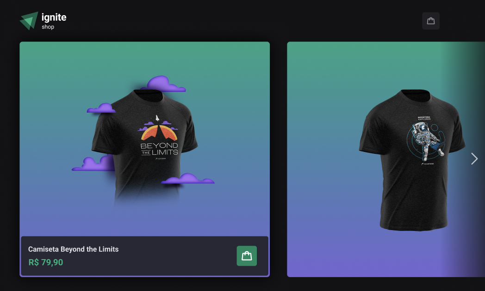
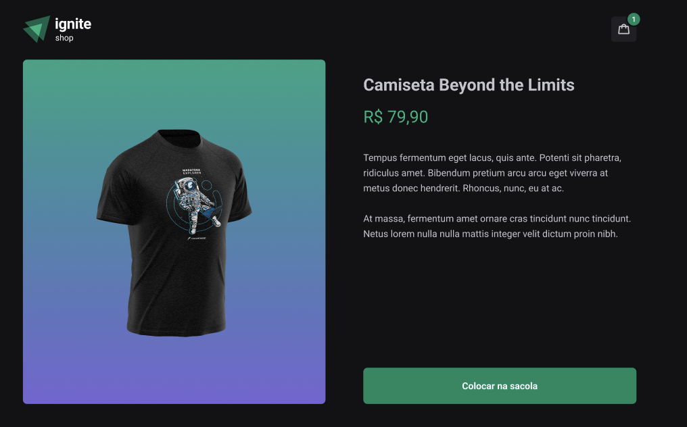
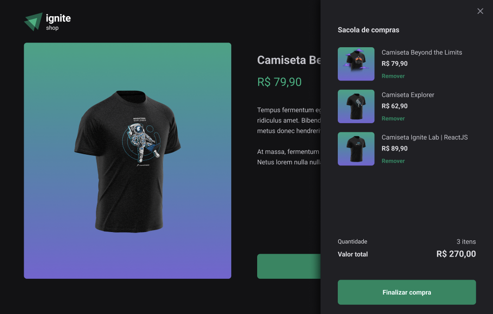
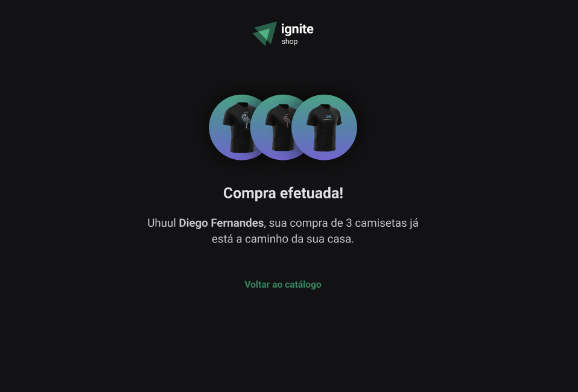

## Ignite Shop

<h3>Página inicial</h3>

<h3>Checkout</h3>

<h3>Checkout Drawer</h3>

<h3>Purchase Finished</h3>

 

### Tecnologias usadas

O projeto foi desenvolvido usando [Next.js](https://nextjs.org/) e [TailwindCSS](https://tailwindcss.com/) para estilizar a aplicação.
Na parte dos formulários foi usado o [Stripe](https://stripe.com/) para realização dos pagamentos e listagem dos produtos.

### License

© Feito com muito &#10084; por Hugo Ramon Pereira -> [Portfolio](https://hugoramonpereira.dev/) -> [LinkedIn](https://www.linkedin.com/in/hugo-ramon-pereira/) 🇧🇷 durante o desafio do curso da [Rocketseat](https://www.rocketseat.com.br/)
